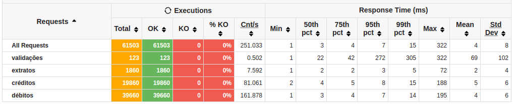
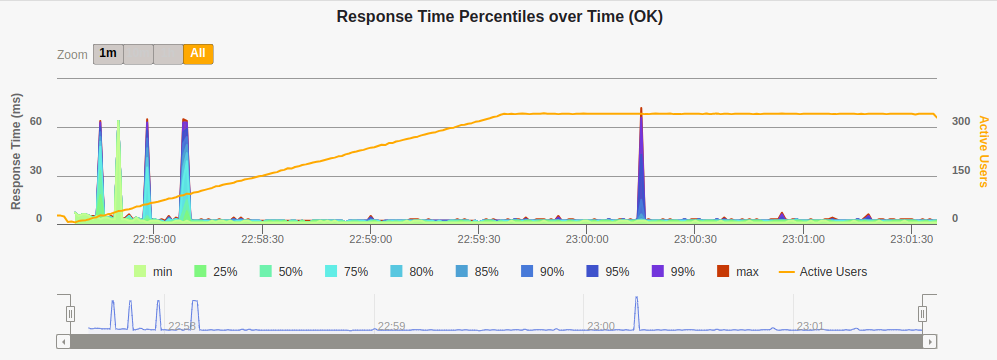
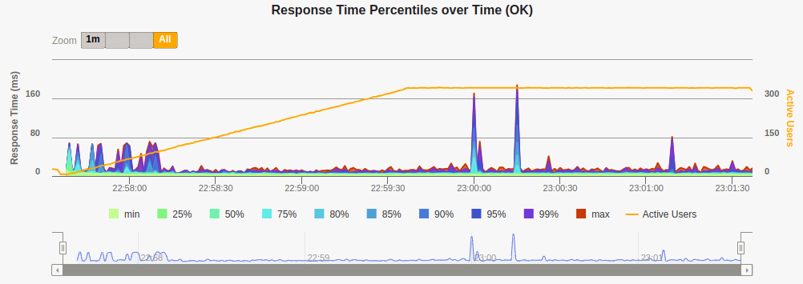
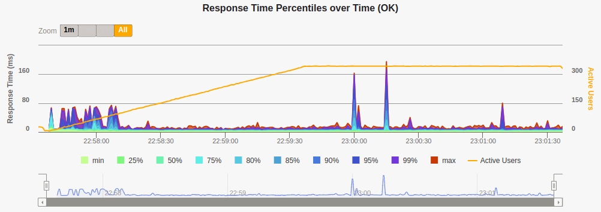
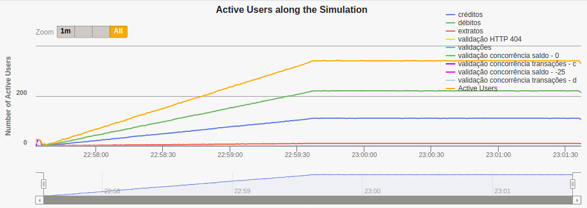

# Rinha de Backend 2024 - Q1

This is my solution to [zanfranceschi/rinha-de-backend-2024-q1](https://github.com/zanfranceschi/rinha-de-backend-2024-q1). It leverages MariaDb concurrency control mechanisms by relying on a pessimistic concurrency control strategy that uses row-based locking during write procedure execution. All the logic and concurrency control is abstracted by database procedures, thus one can easily switch the web API code/technology. The solution feats an ASP.NET 8 WebAPI using C#, [HAProxy](https://www.haproxy.org/) as loadbalancer, and [MariaDb](https://mariadb.org/) 11 as database.

## The architecture

```txt
                +----------+
                |          |
                |  Client  |
                |          |
                +----------+
                     |
                     | HTTP req
                     V
                +-----------+
                |           |
                |  HAProxy  |
                |           |
                +-----------+
                     |
         +-----------+-------------+
         |                         |
         V                         V
+------------------+      +------------------+
|                  |      |                  |
|  ASP.NET WebAPI  |      |  ASP.NET WebAPI  |
|                  |      |                  |
+------------------+      +------------------+
          |                        |
          +-----------+------------+
                      |
                      V
                +-----------+
                |           |
                |  MariaDB  |
                |           |
                +-----------+
```

## Testing, CI and running

Database procedures are tested using a .NET XUnit test project that leverages [TestContainers](https://testcontainers.com/) framework to spin-up a clean version of a MariaDb testing Docker image for each test. The WebAPI's core service is unit tested using XUnit as well.

A simple yet powerful continous integration pipeline was built and runs on GitHub Actions. Tests are run on pull requests to the master branch and the PR can only be completed when all tests pass. When new code reaches the master branch, GitHub actions build and publishes the necessary [Docker image tags to DockerHub](https://hub.docker.com/r/pedroter7/rinha-de-backend-2024-q1).

The challenge solution can be run by using the Docker Compose file in the repo root.

## Load test results and conclusions

### Conclusions

While reliable and fast, the concurrency control strategy employed in this solution tends to perform poorly when concurrency to write to a single resource is high. Given that, this pessimistic approach can be more suitable to applications where the probability of concurrency for a single resource is small, high latency for write requests is tolerable, or the write rate is lower than the read rate. The good thing is that this strategy is easier to implement and verify than an optimistic one.

### Load tests setup

The load tests were performed using Gatling and [this](https://github.com/zanfranceschi/rinha-de-backend-2024-q1/blob/main/load-test/user-files/simulations/rinhabackend/RinhaBackendCrebitosSimulation.scala) simulation. An Azure VM of size Standard F4s v2 (4 vcpus, 8 GiB) was used with the following specs:

- CPU:

  ```txt
  Architecture:                       x86_64
  CPU op-mode(s):                     32-bit, 64-bit
  Byte Order:                         Little Endian
  Address sizes:                      46 bits physical, 48 bits virtual
  CPU(s):                             4
  On-line CPU(s) list:                0-3
  Thread(s) per core:                 2
  Core(s) per socket:                 2
  Socket(s):                          1
  NUMA node(s):                       1
  Vendor ID:                          GenuineIntel
  CPU family:                         6
  Model:                              85
  Model name:                         Intel(R) Xeon(R) Platinum 8272CL CPU @ 2.60GHz
  Stepping:                           7
  CPU MHz:                            2593.906
  BogoMIPS:                           5187.81
  Virtualization:                     VT-x
  Hypervisor vendor:                  Microsoft
  Virtualization type:                full
  L1d cache:                          64 KiB
  L1i cache:                          64 KiB
  L2 cache:                           2 MiB
  L3 cache:                           35.8 MiB
  NUMA node0 CPU(s):                  0-3

  ```

- Memory:
  ```txt
  total        used        free      shared  buff/cache   available
  Mem:          7.8Gi       303Mi       6.3Gi       4.0Mi       1.2Gi       7.2Gi
  Swap:            0B          0B          0B
  ```
- OS:
  ```txt
  NAME="Ubuntu"
  VERSION="20.04.6 LTS (Focal Fossa)"
  ID=ubuntu
  ID_LIKE=debian
  PRETTY_NAME="Ubuntu 20.04.6 LTS"
  VERSION_ID="20.04"
  HOME_URL="https://www.ubuntu.com/"
  SUPPORT_URL="https://help.ubuntu.com/"
  BUG_REPORT_URL="https://bugs.launchpad.net/ubuntu/"
  PRIVACY_POLICY_URL="https://www.ubuntu.com/legal/terms-and-policies/privacy-policy"
  VERSION_CODENAME=focal
  UBUNTU_CODENAME=focal
  ```
- Software:
  ```bash
  java --version
       openjdk 17.0.10 2024-01-16
       OpenJDK Runtime Environment (build 17.0.10+7-Ubuntu-120.04.1)
       OpenJDK 64-Bit Server VM (build 17.0.10+7-Ubuntu-120.04.1, mixed mode, sharing)

  gatling: gatling-charts-highcharts-bundle-3.10.4
  ```

### Load tests results

It is possible to see some peaks in the response time graphs during the first minute of simulation, this probabily has to do with the need for the Web API to create more connections with the database in order to perform queries for the growing number of requests (active users and request rate are proportional quantities) until the connection pool hits its limit.

Overall results:



Overall response times percentile:


Read operations response time percentiles:



Write operations of type _c_ (créditos) response time percentiles:



Write operations of type _d_ (débitos) response time percentiles:



Active users along the simulation:


